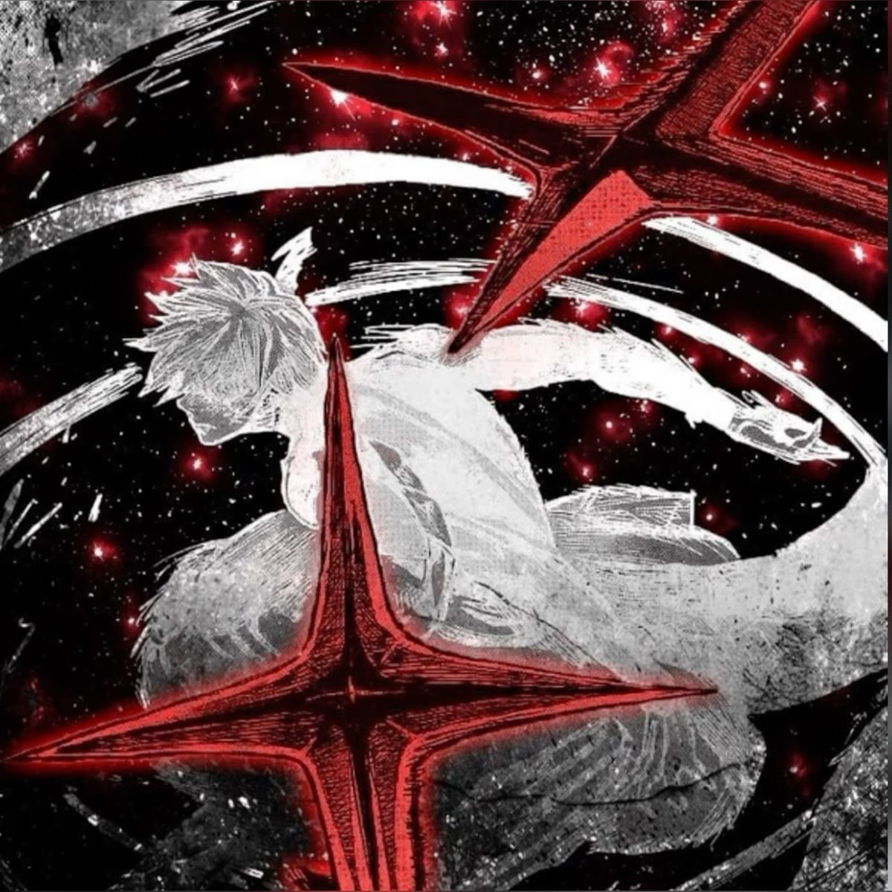

 
 <h1>
    SeaLib
  </h1>

SeaLib is organized like a library with intuitive categories and subcategories, making navigation effortless and AI content discovery seamless

Found a zero-day prompt? Stumbled across an unreleased system card?  
DM **9ohf** on Discord, credit is forever etched in commit history.

- **[SeaLib Website](https://zetalib.neocities.org)** – Landing Page
- **[GitHub Repo](https://github.com/siddaintit/SeaLib)** – Guess where you are, right there
